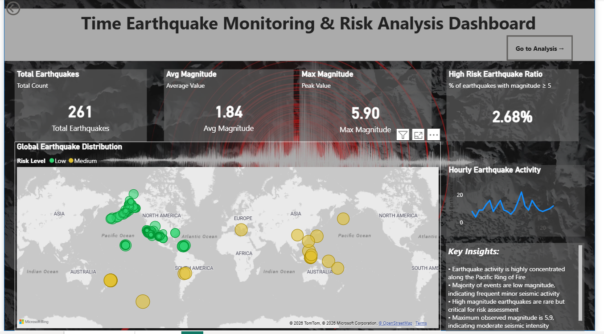
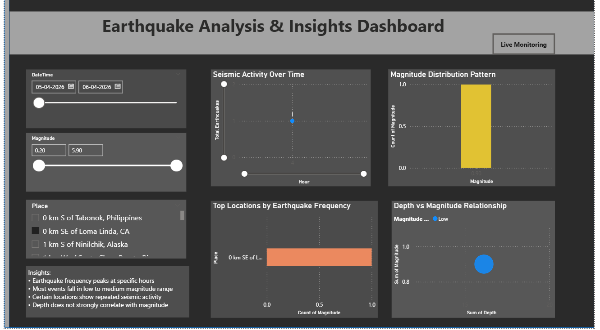

**Earthquake Analysis & Risk Monitoring Dashboard (Power BI)**

---

**Overview**

This project presents an interactive Power BI dashboard designed to analyze global earthquake data in real-time. It helps identify seismic activity patterns, high-risk regions, and temporal trends for better understanding and decision-making.

---

**Features**

* Real-time data integration using API
* Global earthquake distribution visualization (Map)
* Risk classification (Low, Medium, High)
* Hourly seismic activity trend analysis
* Magnitude distribution analysis
* Interactive filtering (Date, Magnitude, Location)
* Depth vs Magnitude relationship analysis

---

**Data Source**

* Real-time earthquake data fetched from the USGS (United States Geological Survey) API
* Data retrieved in JSON format and transformed using Power Query

---

**Data Pipeline**

USGS API → Power Query (JSON Transformation) → Data Modeling (Star Schema) → DAX Measures → Interactive Dashboard

---

**Data Processing**

* Converted JSON data into structured tabular format
* Handled missing values and corrected data types
* Created calculated columns:

  * Magnitude Category (Low, Medium, High)
  * Hour (for time-based analysis)
* Built relationships between tables (Fact and Date dimension)
* Implemented DAX measures for KPIs and insights

---

**Key KPIs**

* Total Earthquakes
* Average Magnitude
* Maximum Magnitude
* High Risk Earthquake Ratio (%)

---

**Key Insights**

* Earthquake activity is highly concentrated along the Pacific Ring of Fire
* Majority of events are low magnitude, indicating frequent minor seismic activity
* High magnitude earthquakes are rare but critical for risk assessment
* Maximum observed magnitude is 5.9, indicating moderate seismic intensity
* Seismic events show regional clustering rather than uniform global distribution

---

**Tech Stack**

* Power BI
* Power Query
* DAX (Data Analysis Expressions)

---

**Project Structure**

* dashboard/ → Power BI file (.pbix)
* images/ → Dashboard screenshots

---

**Dashboard Preview**

**Live Monitoring**

**Detailed Analysis**

---

**Conclusion**

This dashboard provides a comprehensive view of earthquake activity by combining spatial, temporal, and statistical analysis. It enables quick identification of high-risk zones and patterns, making it useful for monitoring and analytical purposes.

---

**Future Enhancements**

* Integration of predictive models for earthquake risk forecasting
* Real-time alert system for high-magnitude events
* Deployment using Power BI Service for live access
